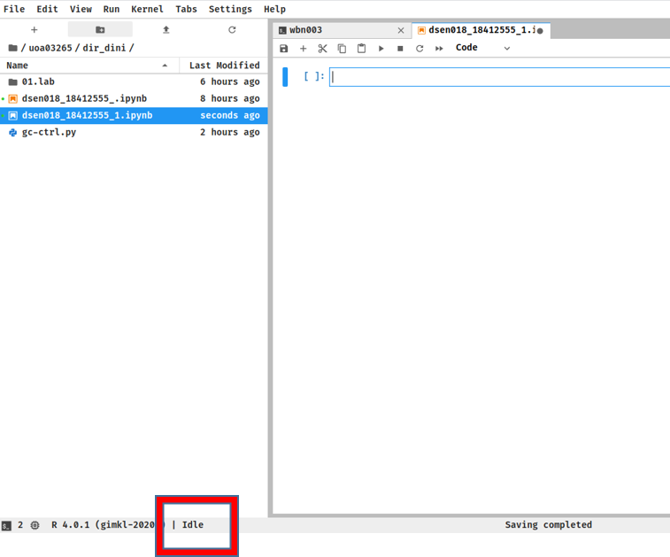

**Change the path to personal working directory**

<p align="center"></p>

1. Select **R 4.0.1** Notebook

<p align="center"></p>


2. Confirm the state is **idle** (Other two states are **Connected** or **Disconnected**)


<p align="center"></p>

3. Copy and paste and one block at a time to Notebook

```R
summary(iris)
library(ggplot2)
```
```R
qplot (Sepal.Length, Petal.Length , data =iris , color =Species, size = Petal.Length)
```
```R
options(repr.plot.width=5, repr.plot.height=5)
set.seed(12)
samples <- rexp(100, rate = 0.2)
s <- seq(0, max(samples), 0.1)
d <- dexp(s, rate = 0.2)
hist(samples, prob = TRUE, main = "", col = adjustcolor("purple", alpha = 0.5), ylim = c(0, max(d)))
lines(density(samples), lty = 2)
curve(dexp(x, rate = 0.2), lwd = 2, add = TRUE)
rug(samples)
```
```R
options(repr.plot.width=5, repr.plot.height=5)
library(ggplot2)
set.seed(4321)
n <- 10000
means <- cumsum(rnorm(n)) / (1 : n) 
qplot(x = 1:n, y = means, 
      geom = "line",
      colour = I("purple"),
      xlab = "sample size", ylab = "cumulative means",
      main = "Law of Large Numbers") +
geom_hline(yintercept = 0)
```
